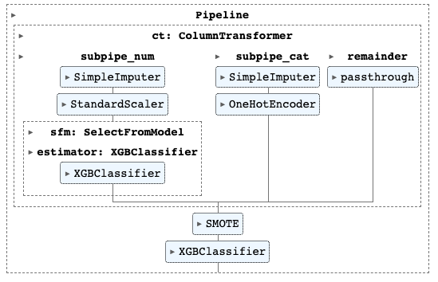

# Applying Machine Learning to End Stage Liver Disease
Student: Will Bennett

Instructor: David Elliot

Active Project Dates: June 26th - July 13th

This project can be viewed live at [StreamLit](https://meldcalc-19nq9gq1tic.streamlit.app/).


https://github.com/willmbennett/meld_calc/assets/41313772/dd6408b1-5736-47ab-abb3-5d807aefe21b


## Intro

The Mayo End-Stage Liver Disease (MELD) score is the current accepted score and is used to prioritize organ allocation for liver transplantation. The MELD score is widely accepted and highly validated, and is continually improved.

This project will be applying machine learning techniques to predict outcomes in patients with end stage liver disease with the hope of outperforming the MELD model.

References:
- [Meld Score MDCALc](https://www.mdcalc.com/calc/10437/model-end-stage-liver-disease-meld?utm_source=site&utm_medium=link&utm_campaign=meld_12_and_older)
- [Original development](https://pubmed.ncbi.nlm.nih.gov/11172350/)
- [Meld-NA improvement](https://pubmed.ncbi.nlm.nih.gov/18768945/)
- [Meld 3.0 (current)](https://pubmed.ncbi.nlm.nih.gov/34481845/)

**Project Inspiration**

Introducing [MDCalc](https://www.mdcalc.com/)

> "MDCalc is a free online medical reference for healthcare professionals that provides point-of-care clinical decision-support tools, including medical calculators, scoring systems, and algorithms." - [Wikipedia](https://en.wikipedia.org/wiki/MDCalc)

**Business Case**

*Disclaimer: this case is imaginary*

Beth Israel Deaconess Medical Center is looking to improve on their outcomes for patients with end stage liver disease. To do that they've asked me to come up with an improved method of predicting outcomes (compared to MELD scores).

**The Data**

For this project I will be using a publicly available dataset from Beth Israel Deaconess Medical Center called [MIMIC-IV](https://physionet.org/content/mimiciv/2.2/).
>“The Medical Information Mart for Intensive Care (MIMIC)-III database provided critical care data for over 40,000 patients admitted to intensive care units at the Beth Israel Deaconess Medical Center (BIDMC).” - [Physionet](https://physionet.org/content/mimiciv/2.2/)

*Dataset limitation: this data did not include whether patients went on to get a liver transplant, a key datapoint for liver transplantation selection methods. Thus further work on the project should use the OPTN data which includes liver transplant data.*

** Technical Details**

Technologies used: StandardScaler, OneHotEncoder, PolynomialFeatures, ColumnTransformer, Pipelines

# Conclusion

My goal was to create a model that performed better than MELD on this dataset. Meld C-statistic (AUC) was 0.76 and I was able to select a model that performed significantly better than MELD, although I did end up having to use more features (10 or more).

The best performing model I created was XGBoost utilizing many data science tools including scaling, encoding, imputing, clustering, smote, and selecting top features from a model. The final model had a C-statistic of 0.82 and a accuracy score of 82% on unseen data. 


The model saw a drastic reduction of false positives (9.5%) which is desirable since we really don't want to have patients undergo liver transplants unless they really need it. The trade-off is an increase in false-negatives (50%) but that should be acceptable since there are other treatments for those patients and they could get moved up in line in the future if they are re-admitted to the hospital.


**Final Model Diagram**



**Recommendations**
- Implement simplified model in Will's MELD calculator for a quick win
- Add race to the official MELD calculator
- Integrate full model with EHR to improve accuracy and reduce reliance on manual calculators


**Analysis Next Steps**
- Investigate performance of model for different races to determine existance of bias
- Work with medical professional to improve cohort selection and model interpretation
- Use OPTN data to investigate if model could replace MELD for liver transplant prioritization

## For More Information

Please review the full analysis in [the Jupyter Notebook](./index.ipynb) or [the presentation](./presentation.pdf).

For any additional questions, please contact Will Bennett at <wbennett711@gmail.com>

## Repository Structure

```
├── data (cleaned data)
├── data_cleaning (additional notebook for data cleaning)
├── images
├── models (model pickle files)
├── presentation.pdf
├── .gitignore
├── README.md
├── index.ipynb (main notebook)
└── streamlit_app.py (streamlit app)
```
